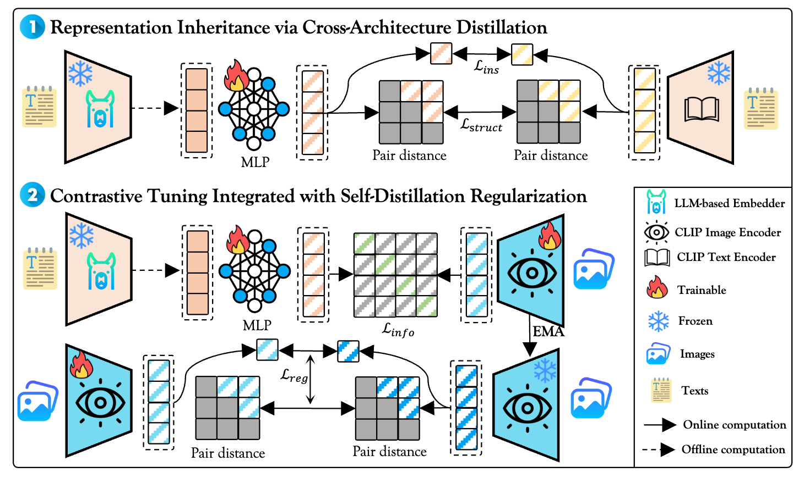
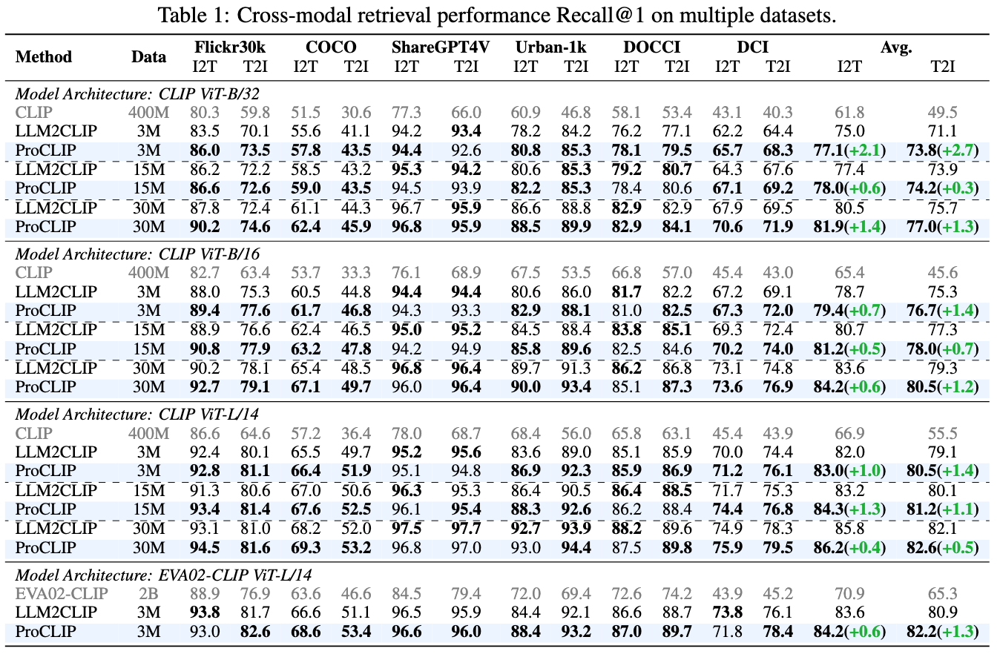
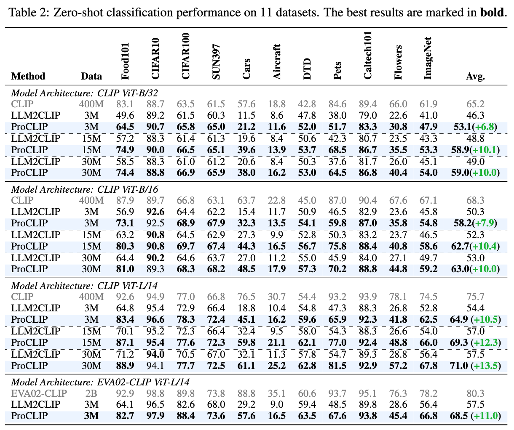
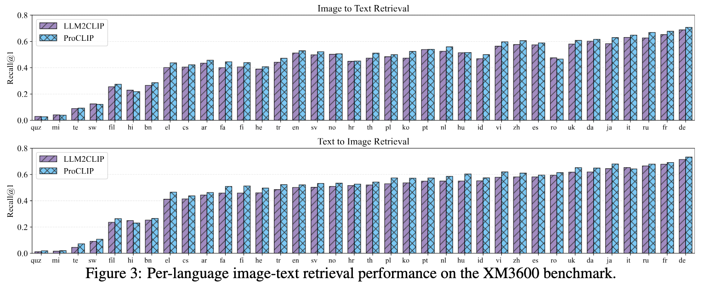
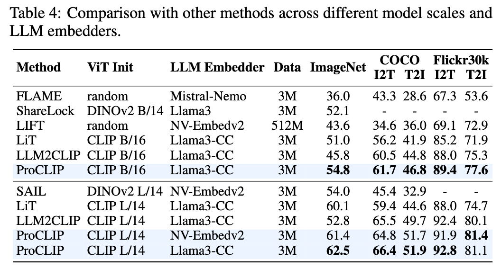

<p align="center">
  <h1 align="center">ProCLIP: Progressive Vision-Language Alignment via LLM-based Embedder</h1>
  <p align="center">
      <a href='https://scholar.google.com.hk/citations?user=zBM8_XkAAAAJ&hl=zh-CN&oi=ao' style='text-decoration: none' >Xiaoxing Hu</a><sup>1*</sup>&emsp;
      <a href='https://scholar.google.com.hk/citations?user=AQMkoXIAAAAJ&hl=zh-CN' style='text-decoration: none' >Kaicheng Yang</a><sup>1*</sup>&emsp;  
      <a href='https://scholar.google.com.hk/citations?user=cWip8QgAAAAJ&hl=zh-CN' style='text-decoration: none' >Ziyang Gong</a><sup>3</sup>&emsp;
      <a href='https://scholar.google.com.hk/citations?user=zQCpqs8AAAAJ&hl=zh-CN&oi=ao' style='text-decoration: none' >Qi Ming</a><sup>4</sup>&emsp;
      <a href='https://scholar.google.com.hk/citations?user=h1I6LJcAAAAJ&hl=zh-CN&oi=ao' style='text-decoration: none' >Zonghao Guo</a><sup>5</sup>&emsp;
      <a href='https://scholar.google.com/citations?user=1ckaPgwAAAAJ&hl=zh-CN' style='text-decoration: none' >Xiang An</a><sup>2</sup>&emsp;
      <a href='https://openreview.net/profile?id=~Ziyong_Feng1' style='text-decoration: none' >Ziyong Feng</a><sup>2</sup>&emsp;
      <a href='https://scholar.google.com/citations?user=ga230VoAAAAJ&hl=zh-CN&oi=ao' style='text-decoration: none' >Junchi Yan</a><sup>3</sup>&emsp;
      <a href='https://scholar.google.com/citations?user=2xTlvV0AAAAJ&hl=zh-CN&oi=ao' style='text-decoration: none' >Xue Yang</a><sup>3†</sup>&emsp;

<div align="center">
<div style="line-height:1.1;">
<sup>1</sup> Beijing Institute of Technology <sup>2</sup> DeepGlint <sup>3</sup> Shanghai Jiao Tong University<br>
<sup>4</sup> Beijing University of Technology <sup>5</sup> Tsinghua University<br>
<sup>*</sup> Equal contribution <sup>†</sup> Corresponding author
</div>

</div>
    <p align='center'>
        If you find our work helpful, please consider giving us a ⭐!
    </p>
   </p>
</p>


Official PyTorch implementation of [ProCLIP: Progressive Vision-Language Alignment via LLM-based Embedder.]

<div align="center">
  
</div>


## Notice
This repository is still being organized and refined. If you encounter any issues while using it, please contact |Email: xiaoxinghhh@gmail.com|WeChat: 15111480307| or submit an issue. Thank you for your attention.

## TODO
- [ ] Training and validation instruction
- [ ] Paper Link
- [x] Model Weights

## 📖 Introduction

This repository contains the official pytorchimplementation of [ProCLIP: Progressive Vision-Language Alignment via LLM-based Embedder.]. We introduce a progressive vision-language alignment approach that aligns the LLM-based embedder with the CLIP image encoder in a curriculum learning manner to enhance long-text, multilingual, and fine-grained understanding.

Paper Link: []()
Model Zoo: [](https://huggingface.co/wsdwJohn1231/ProCLIP_weight)


## 📖 Methodology

<div align="center">
  
</div>

- Stage 1: Align the LLM-based embedder with the CLIP text encoder via Cross-Architecture Distillation.
- Stage 2: Align the LLM-based embedder with the CLIP image encoder with Self-Distillation Regularization.
## 🛠️ Requirements

- Python >= 3.9
- CUDA >= 11.8 (if using GPU)
- Other dependencies in `requirements.txt`

## 🚀 Installation

- Clone this repository and install dependencies:

```bash
# Clone the repo
git clone https://github.com/VisionXLab/ProCLIP.git
cd ProCLIP

# Create virtual environment
conda create -n proclip python=3.9 -y
conda activate proclip
# Install dependencies
pip install -r requirements.txt
```

### Training
Coming soon.


### Evaluation
Coming soon.

## 📊 Results

### Retrieval Results

### Classification Results

### Multilingual Retrieval Results


### Comparison with other LLM embedders-based CLIP models


- **More results can be found in the paper.**
## 📜 Citation

If you find our work helpful, please cite our paper:

```bibtex
to be updated.
```

## 📝 License

This project is licensed under the MIT License - see the [LICENSE](LICENSE) file for details.

## 🙌 Acknowledgments

Our work is inspired by [LLM2CLIP](https://github.com/microsoft/LLM2CLIP) and [CLIP](https://github.com/openai/CLIP). We are grateful for their outstanding work and code.
