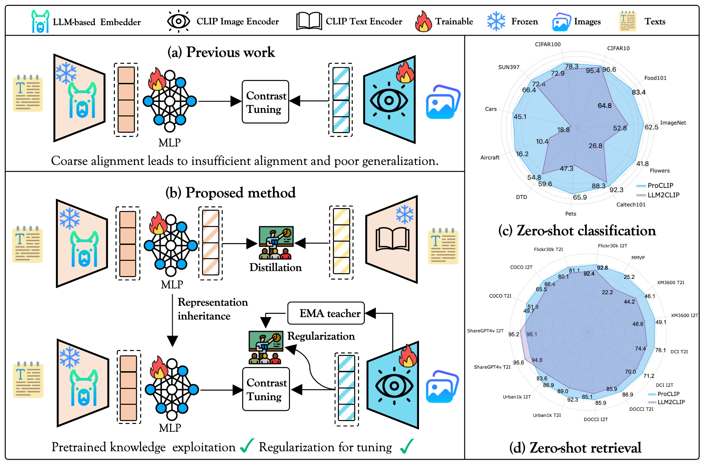

<p align="center">
  <h1 align="center">ProCLIP: Progressive Vision-Language Alignment via LLM-based Embedder.</h1>
  <p align="center">
      <a href='https://scholar.google.com.hk/citations?user=zBM8_XkAAAAJ&hl=zh-CN&oi=ao' style='text-decoration: none' >Xiaoxing Hu</a><sup></sup>&emsp;
      <a href='https://scholar.google.com.hk/citations?user=AQMkoXIAAAAJ&hl=zh-CN' style='text-decoration: none' >Kaicheng Yang</a><sup></sup>&emsp;  
      <a href='https://scholar.google.com.hk/citations?user=cWip8QgAAAAJ&hl=zh-CN' style='text-decoration: none' >Ziyang Gong</a><sup></sup>&emsp;
      <a href='https://scholar.google.com.hk/citations?user=zQCpqs8AAAAJ&hl=zh-CN&oi=ao' style='text-decoration: none' >Qi Ming</a><sup></sup>&emsp;
      <a href='https://scholar.google.com.hk/citations?user=h1I6LJcAAAAJ&hl=zh-CN&oi=ao' style='text-decoration: none' >Zonghao Guo</a><sup></sup>&emsp;
      <a href='https://scholar.google.com/citations?user=1ckaPgwAAAAJ&hl=zh-CN' style='text-decoration: none' >Xiang An</a><sup></sup>&emsp;
      <a href='https://openreview.net/profile?id=~Ziyong_Feng1' style='text-decoration: none' >Ziyong Feng</a><sup></sup>&emsp;
      <a href='https://scholar.google.com/citations?user=ga230VoAAAAJ&hl=zh-CN&oi=ao' style='text-decoration: none' >Junchi Yan</a><sup></sup>&emsp;
      <a href='https://scholar.google.com/citations?user=2xTlvV0AAAAJ&hl=zh-CN&oi=ao' style='text-decoration: none' >Xue Yang</a><sup></sup>&emsp;
      <!-- <h3 align='center'>CVPR 2025</h3> -->
      <div align="center">
      <!-- <!-- <a href='https://arxiv.org/abs/2501.04440'></a> -->
      <!-- <a href='https://github.com/zhasion/RSAR'></a>
      <a href='https://drive.google.com/file/d/1v-HXUSmwBQCtrq0MlTOkCaBQ_vbz5_qs/view?usp=sharing'></a> -->
      <!-- <a href='https://pan.baidu.com/s/1DVUNBuWrhJRg0H1qhwtfEQ?pwd=rsar'></a>
      <!-- <a href='https://zhuanlan.zhihu.com/p/16758735545'></a> -->
	  </div>
    <p align='center'>
        If you find our work helpful, please consider giving us a ⭐!
    </p>
   </p>
</p>


Official PyTorch implementation of [ProCLIP: Progressive Vision-Language Alignment via LLM-based Embedder.]

<div align="center">
  
</div>


## Notice
This repository is still being organized and refined. If you encounter any issues while using it, please contact |Email: xiaoxinghhh@gmail.com|WeChat: 15717699268| or submit an issue. Thank you for your attention.

## TODO
- [ ] Training and validation instruction
- [ ] paper link
- [ ] Model Weights

## 📖 Introduction

This repository contains the official pytorchimplementation of [ProCLIP: Progressive Vision-Language Alignment via LLM-based Embedder.]. We introduce a progressive vision-language alignment approach that aligns the LLM-based embedder with the CLIP image encoder in a curriculum learning manner to enhance long-text, multilingual, and fine-grained understanding.

Paper: [Paper Link]()

## 📖 Methodology

<div align="center">
  
</div>

- Stage 1: Align the LLM-based embedder with the CLIP text encoder via Cross-Architecture Distillation.
- Stage 2: Align the LLM-based embedder with the CLIP image encoder with Self-Distillation Regularization.
## 🛠️ Requirements

- Python >= 3.9
- CUDA >= 11.8 (if using GPU)
- Other dependencies in `requirements.txt`

## 🚀 Installation

- Clone this repository and install dependencies:

```bash
# Clone the repo
git clone https://github.com/VisionXLab/ProCLIP.git
cd ProCLIP

# Create virtual environment
conda create -n proclip python=3.9 -y
conda activate proclip
# Install dependencies
pip install -r requirements.txt
```

### Training
Coming soon.


### Evaluation
Coming soon.

## 📊 Results

### Retrieval Results

### Classification Results

### Multilingual Retrieval Results


### Comparison with other LLM embedders-based CLIP models


- **More results can be found in the paper.**
## 📜 Citation

If you find our work helpful, please cite our paper:

```bibtex
to be updated.
```

## 📝 License

This project is licensed under the MIT License - see the [LICENSE](LICENSE) file for details.

## 🙌 Acknowledgments

Our work is inspired by [LLM2CLIP](https://github.com/microsoft/LLM2CLIP) and [CLIP](https://github.com/openai/CLIP). We are grateful for their outstanding work and code.
